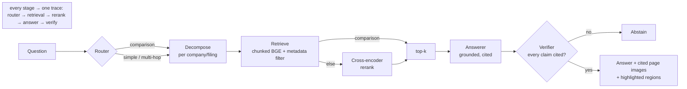

# Sightline

A visual-first document-intelligence system over SEC filings. It answers analyst-grade questions
about 10-Ks and 10-Qs by retrieving and reasoning over **page images** (OCR-free, layout-preserving)
and returns answers with page-level citations — or honestly abstains when the corpus can't support one.

> **The numbers** (44-case benchmark over 20 filings / 1,329 pages, all on free/CPU models):
> retrieval **Recall@5 0.603** (a measured **+91%** over the dense baseline, via a router that
> picks the best config per question type), generation **correctness 0.90 / abstention recall
> 1.00**, at a two-stage-retrieve cost that is **99.5% cheaper** than sending every page to a
> VLM. Every number is reproducible (`docs/RESULTS.md`) — including a benched BM25 row and a
> visual retriever that was *measured out* of the champion config rather than assumed in.

> New here? Read `docs/DESIGN_DOC.md` (the what/why) and `docs/IMPLEMENTATION_PLAN.md` (the how).
> If you're using Claude Code, `CLAUDE.md` has the full context and build order.

## Why this exists
Financial filings are visually dense — nested tables, footnotes, charts. OCR-and-chunk pipelines
mangle exactly those. Sightline treats each page as an image and retrieves on layout + content using
late-interaction visual retrieval (the ColPali / ColQwen family). The differentiator over a typical
RAG project is the **evaluation harness**: everything is measured, and every improvement is proven.

## Pipeline



Retrieval config is chosen **per question type** (the router doubles as a quality optimizer);
the answer never ships unless the verifier confirms every claim is cited, else it abstains.

## Status — M1–M4 done, M5 all but deploy/Loom
| Milestone | State |
|---|---|
| M0 Scaffold · M1 Baseline+eval | ✅ done |
| M2 Visual + hybrid retrieval | ✅ 13-config ablation; **champion Recall@5 0.603 (+91%)** |
| M3 Agents + grounding | router · verifier · decomposition · config-routing ✅; Cohen's κ harness built (needs human labels) |
| M4 LLMOps | money-shot (99.5% cheaper) · CI eval gate · rendered trace · prompt registry · cache ✅ |
| M5 Serving + UI | landing + console · region highlighting · load-once serving · Dockerfile ✅; deploy + Loom pending |

Corpus: 20 SEC filings / 1,329 page images (NVDA/AMD/INTC/MU/QCOM). 44-case hand-verified
benchmark. All on **free/CPU models** (total build spend: $0.22). Full numbers, the ablation
table, and reproduce commands: [`docs/RESULTS.md`](docs/RESULTS.md).

## Quickstart
```bash
# 1. Python env (uv recommended)
uv venv && source .venv/bin/activate
uv pip install -e ".[dev]"
# (or: pip install -e ".[dev]")

# 2. Install the headless browser used to render EDGAR HTML -> PDF
#   (PyMuPDF handles PDF -> PNG + text, so no poppler needed)
playwright install chromium

# 3. Config
cp .env.example .env
# edit .env — set SEC_USER_AGENT to "Your Name your@email.com" (required by the SEC)

# 4. Infra (Qdrant + Langfuse)
docker compose up -d

# 5. Try the ingestion CLI (pulls a couple of filings)
python scripts/ingest.py --tickers NVDA AMD --forms 10-K --limit 1

# 6. Run the API and the eval harness
make api
make eval
```

## Layout
```
src/sightline/
  config.py          # settings (pydantic-settings, reads .env)
  observability.py   # tracing helper (Langfuse if configured, else no-op)
  ingest/            # EDGAR client + PDF→image rasterization
  retrieval/         # text baseline now; visual + hybrid later
  agents/            # LangGraph router/planner/answerer/verifier (M3)
  eval/              # eval harness + golden set
  api/               # FastAPI app
scripts/             # CLI entry points
tests/               # pytest
docs/                # design doc + implementation plan
.github/workflows/   # CI eval gate
```

## The one rule
Measure the baseline before you build anything clever. That discipline is what turns this from a
student project into a system you designed and evaluated.
