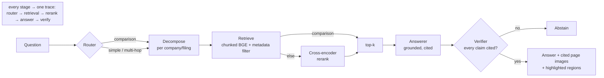

# Sightline

A visual-first document-intelligence system over SEC filings. It answers analyst-grade questions
about 10-Ks and 10-Qs by retrieving and reasoning over **page images** (OCR-free, layout-preserving)
and returns answers with page-level citations — or honestly abstains when the corpus can't support one.

> **The numbers** (44-case benchmark over 15 companies / 32 filings / 2,353 pages, on free/CPU models):
> retrieval **Recall@5 0.603** (a measured **+91%** over the dense baseline, via a router that
> picks the best config per question type), generation **correctness 0.90 / abstention recall
> 1.00**, at a two-stage-retrieve cost that is **99.5% cheaper** than sending every page to a
> VLM. Every number is reproducible (`docs/RESULTS.md`) — including a benched BM25 row and a
> visual retriever that was *measured out* of the champion config rather than assumed in.

> New here? [`docs/ARCHITECTURE.md`](docs/ARCHITECTURE.md) is the system design;
> [`docs/RESULTS.md`](docs/RESULTS.md) is the measured results and ablation table.

## Why this exists
Financial filings are visually dense — nested tables, footnotes, charts. OCR-and-chunk pipelines
mangle exactly those. Sightline treats each page as an image and retrieves on layout + content using
late-interaction visual retrieval (the ColPali / ColQwen family). The differentiator over a typical
RAG project is the **evaluation harness**: everything is measured, and every improvement is proven.

## Pipeline



Retrieval config is chosen **per question type** (the router doubles as a quality optimizer);
the answer never ships unless the verifier confirms every claim is cited, else it abstains.

## What's implemented
- **Retrieval** — dense (BGE) + chunking + metadata filtering + cross-encoder reranking, fused
  and routed per question type; BM25 and late-interaction visual retrieval implemented and
  measured. Full 13-configuration ablation → **champion Recall@5 0.603**.
- **Generation** — grounded answers with page-level citations, a deterministic verifier that
  forces abstention on unsupported claims, and honest refusal on unanswerable questions.
- **Evaluation** — a 44-case hand-verified benchmark (retrieval + generation metrics), an
  LLM-as-judge with a deterministic numeric fallback, and a CI regression gate.
- **Serving** — FastAPI console + landing page, inline cited page images with region
  highlighting, a rendered per-request trace, response caching, upload-your-own-PDF, Dockerfile.

Corpus: **15 companies / 32 SEC filings / 2,353 page images**. Tripling the company count left
the champion score *unchanged* (0.603 → 0.603) while unfiltered retrieval sat at 0.325 — the
filter-and-route design makes corpus growth a no-op instead of a liability. Full numbers, the
ablation table, and reproduce commands: [`docs/RESULTS.md`](docs/RESULTS.md).

## Quickstart
```bash
# 1. Python env (uv recommended)
uv venv && source .venv/bin/activate
uv pip install -e ".[dev]"
# (or: pip install -e ".[dev]")

# 2. Install the headless browser used to render EDGAR HTML -> PDF
#   (PyMuPDF handles PDF -> PNG + text, so no poppler needed)
playwright install chromium

# 3. Config
cp .env.example .env
# edit .env — set SEC_USER_AGENT to "Your Name your@email.com" (required by the SEC)

# 4. Infra (Qdrant + Langfuse)
docker compose up -d

# 5. Try the ingestion CLI (pulls a couple of filings)
python scripts/ingest.py --tickers NVDA AMD --forms 10-K --limit 1

# 6. Run the API and the eval harness
make api
make eval
```

## Layout
```
src/sightline/
  config.py          # settings (pydantic-settings, reads .env)
  observability.py   # tracing helper (Langfuse if configured, else no-op)
  ingest/            # EDGAR client + PDF→image rasterization + uploads
  retrieval/         # dense, bm25, visual, fusion, rerank, routing
  agents/            # deterministic query router
  eval/              # eval harness + golden set
  api/               # FastAPI app
scripts/             # CLI entry points
tests/               # pytest
docs/                # architecture + measured results
.github/workflows/   # CI (tests, lint, eval regression gate)
```

## Design principle
Measure the baseline before adding anything clever, and prove every improvement with a number on
the benchmark. Techniques that don't earn their place get benched — and the benched results are
published alongside the wins.
